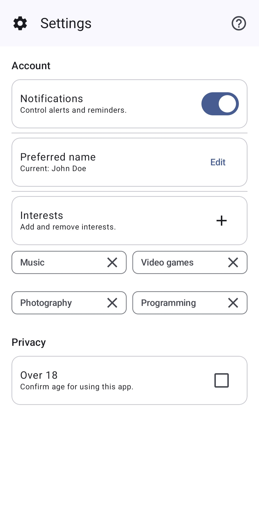
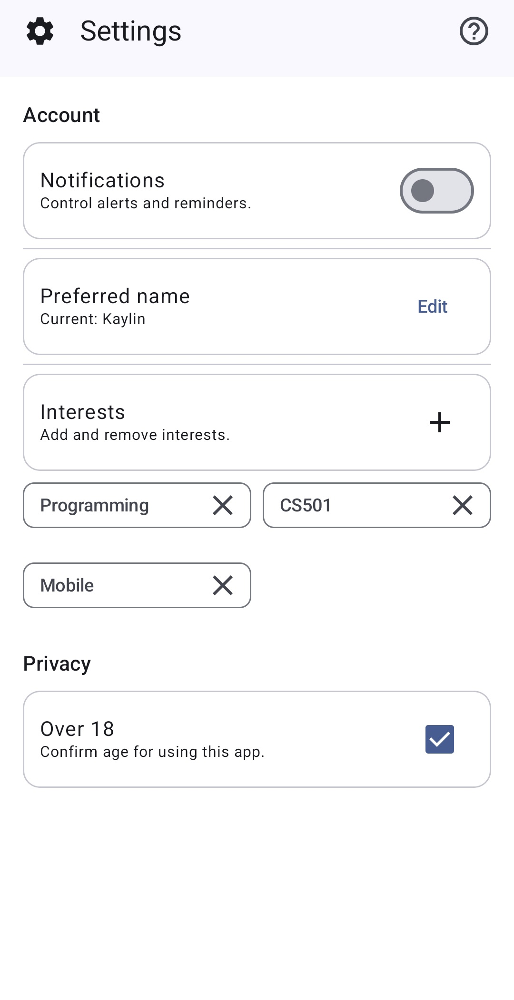

 Settings Screen App

This project is a settings screen built using **Kotlin** and **Jetpack Compose Material 3**.  
The goal of the app is to demonstrate layout structure, reusable composables, and common settings interactions such as switches, checkboxes, dialogs, and editable user preferences.

## Features
- Top app bar with help dialog
- Notifications switch
- Editable preferred name
- Dynamic interest chips (add and remove custom interests)
- Age confirmation checkbox (Over 18)
- Dialog pop-ups for editing information
- Consistent Material 3 styling and layout

---

## Screenshots

### App opened

### Information changed

---

## AI Disclosure
I used AI to help understand how to implement Material 3 UI components in Jetpack Compose and how to structure a settings screen layout. I used AI to generate a mock-up image of the UI for visual inspiration before coding. I used AI to figure out how to force the app to stay in light mode for consistent screenshots. I used AI to understand how to pass and use a composable control function (`control()`) inside a reusable row component. I used AI for advice on how to display the interest chips in a readable, well-spaced layout.

---
